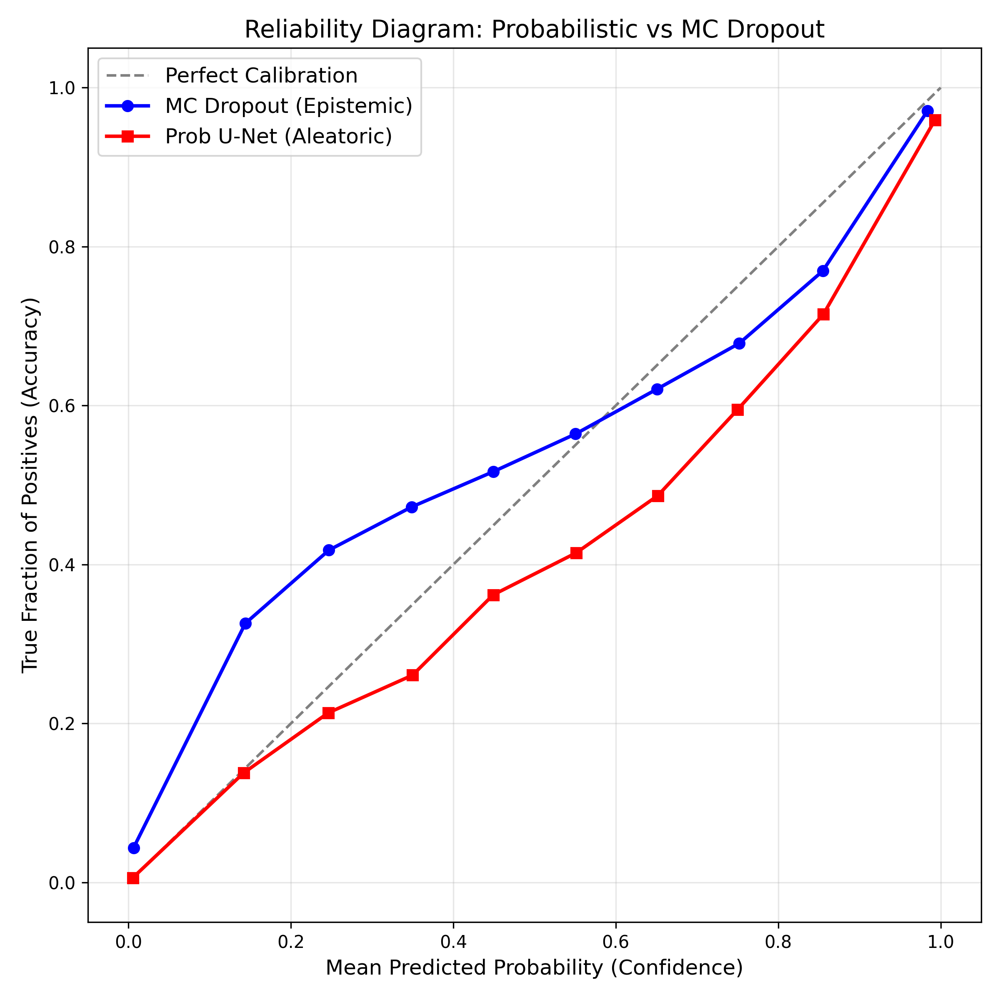
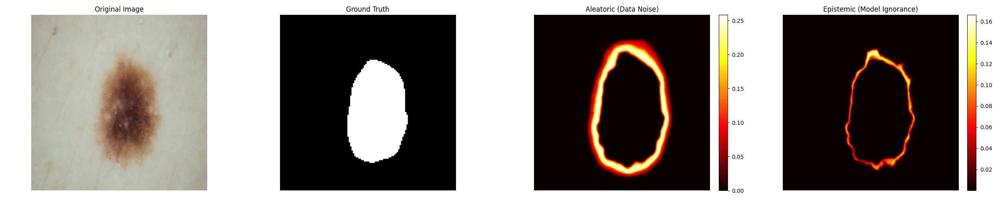

# Results

All results below are computed on a held-out test set of **100 ISIC images**, unseen during training. Two models are compared: the **Probabilistic U-Net** (aleatoric uncertainty via VAE latent sampling) and **MC Dropout** (epistemic uncertainty via stochastic forward passes, \(N=30\text{–}50\)).

---

## Why Calibration Metrics Matter

Overlap metrics like Dice and IoU tell you *how accurate* a predicted mask is on average — but they say nothing about whether the model's **confidence** can be trusted. In a clinical setting, a model that is 90% confident should be correct roughly 90% of the time; if it isn't, its confidence scores are misleading regardless of how good the average segmentation looks.

!!! warning "Interpretation"
    A model can have strong Dice/IoU and still be poorly calibrated — confidently wrong in specific regions. For a tool meant to flag *where a clinician should look more closely*, calibration is arguably more important than raw overlap accuracy.

This is why, alongside Dice and IoU, this project reports:

- **Brier Score** — measures the accuracy of probabilistic predictions directly, as the mean squared error between predicted probabilities and the binary outcome. Lower is better.
- **Expected Calibration Error (ECE)** — bins predictions by confidence and measures the gap between confidence and actual accuracy within each bin. Lower is better. An ECE of 0 means confidence scores perfectly track real-world correctness (e.g. predictions made with 90% confidence really are correct 90% of the time).

---

## Quantitative Comparison

| Metric | Probabilistic U-Net | MC Dropout | Better |
|---|:---:|:---:|:---:|
| Dice ↑ | **0.8788** | 0.8600 | Probabilistic U-Net |
| IoU ↑ | **0.7960** | 0.7779 | Probabilistic U-Net |
| Brier Score ↓ | **0.0427** | 0.0613 | Probabilistic U-Net |
| ECE ↓ | **0.0565** | 0.0752 | Probabilistic U-Net |

*(↑ higher is better, ↓ lower is better; n = 100 test images)*

### Takeaways

- The **Probabilistic U-Net outperforms MC Dropout on every metric**, including both overlap accuracy (Dice, IoU) and calibration (Brier, ECE).
- The calibration gap is proportionally larger than the accuracy gap — Brier Score improves by ~30% and ECE by ~25% relative to MC Dropout, versus a ~2 point Dice improvement. This suggests the Probabilistic U-Net's advantage isn't just "better segmentation," it's specifically **better-calibrated uncertainty**, which is the more clinically relevant property for a decision-support tool.
- This is consistent with the architectural difference: the Probabilistic U-Net's latent space is trained explicitly against boundary variability (via the simulated multi-rater signal, see [Methodology](methodology.md)), while MC Dropout's uncertainty is a byproduct of weight-space regularization not directly tied to boundary ambiguity.

---

## Reliability Diagram

A reliability diagram plots predicted confidence (x-axis) against observed accuracy (y-axis), binned into confidence intervals. A perfectly calibrated model lies exactly on the diagonal.

**Analysis:** The Probabilistic U-Net's calibration curve stays consistently closer to the diagonal across confidence bins than MC Dropout's, which tends to show overconfidence in the higher-confidence bins — a common failure mode where a model's predicted probabilities skew higher than its true accuracy warrants. This visual pattern is consistent with the Probabilistic U-Net's lower ECE reported above.

---

## Visual Analysis

For qualitative inspection, each test case is visualized as a four-panel grid:

1. **Input** — the raw dermoscopic image
2. **Aleatoric Uncertainty** — per-pixel variance from the Probabilistic U-Net's latent samples (data ambiguity)
3. **Epistemic Uncertainty** — per-pixel variance from MC Dropout's stochastic passes (model uncertainty)
4. **Ground Truth** — the reference annotation

!!! info "Clinical Note"
    In typical cases, aleatoric uncertainty concentrates tightly along the lesion border — exactly where a human rater would also hesitate. Epistemic uncertainty is more diffuse and case-dependent, spiking on lesions with atypical texture or color patterns underrepresented in training data. Seeing both maps side by side lets a clinician distinguish *"the image itself is ambiguous here"* from *"the model hasn't seen much like this before."*

!!! note
    Confirm the exact asset filename/path above (`evaluation_results/compare_uncertainties/compare_1.png`) matches what's committed to the repo, and swap in the real exported image if the filename differs.

---

## Next

- [Deployment](deployment.md) — how to run this model live via the FastAPI backend
